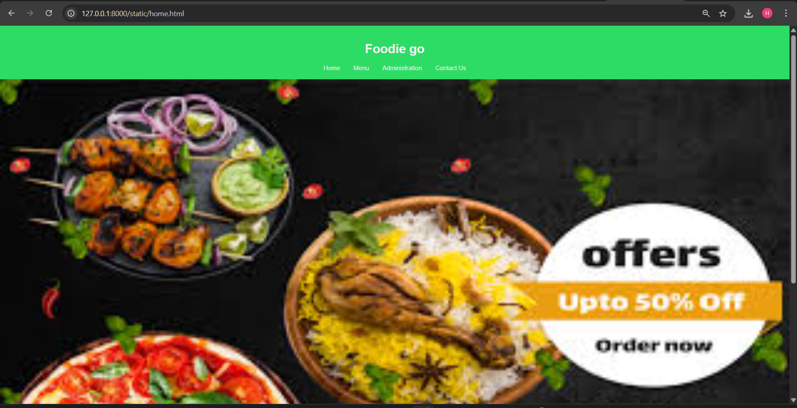
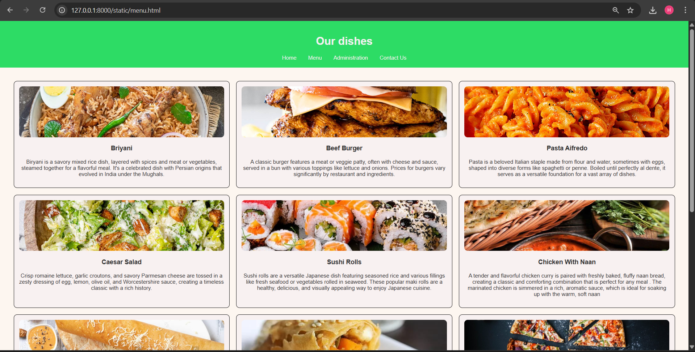
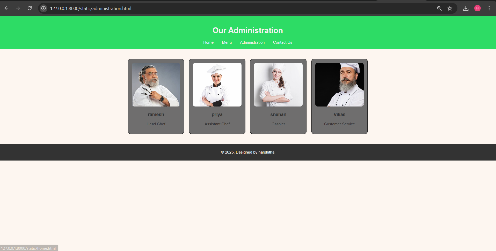
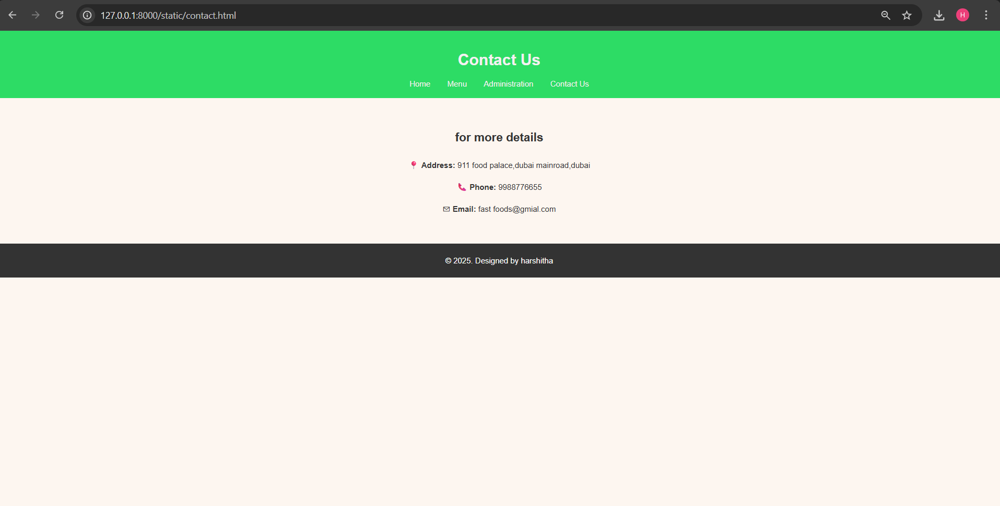

# Ex.06 Restaurant Website
## Date: 21-12-2025

## AIM:
To develop a static Restaurant website to display the food items and services provided by them.

## DESIGN STEPS:

### Step 1:
Requirement collection.

### Step 2:
Creating the layout using HTML and CSS.

### Step 3:
Updating the sample content.

### Step 4:
Choose the appropriate style and color scheme.

### Step 5:
Validate the layout in various browsers.

### Step 6:
Validate the HTML code.

### Step 7:
Publish the website in the given URL.

## PROGRAM:
```
home.html
<!DOCTYPE html>
<html lang="en">
<head>
  <meta charset="UTF-8">
  <title>Foodie go</title>
  <link rel="stylesheet" href="style.css">
</head>
<body>
  <header>
    <h1> Foodie go </h1>
    <nav>
      <a href="home.html">Home</a>
      <a href="menu.html">Menu</a>
      <a href="administration.html">Administration</a>
      <a href="contact.html">Contact Us</a>
    </nav>
  </header> 

  <section class="banner">
    
  </section>
  

  <section class="content">
    <h2>Welcome!</h2>
    <p>Discover the best food in town, made with passion and fresh ingredients.</p>
  </section>

  <footer>
    <p>&copy; 2025. Designed by harshitha</p>
  </footer>
</body>
</html>

menu.html
<!DOCTYPE html>
<html lang="en">
<head>
  <meta charset="UTF-8">
  <title>Menu - fast foods</title>
  <link rel="stylesheet" href="style.css">
</head>
<body>
  <header>
    <h1>Our dishes</h1>
    <nav>
      <a href="home.html">Home</a>
      <a href="menu.html">Menu</a>
      <a href="administration.html">Administration</a>
      <a href="contact.html">Contact Us</a>
    </nav>
  </header>

  <section class="menu-grid">
   
    <div class="menu-item">
      
      <h3>Briyani </h3>
      <p>Biryani is a savory mixed rice dish, layered with spices and meat or vegetables, steamed together for a flavorful meal. It's a celebrated dish with Persian origins that evolved in India under the Mughals.</p>
    </div>
    <div class="menu-item">
      
      <h3>Beef Burger</h3>
      <p>A classic burger features a meat or veggie patty, often with cheese and sauce, served in a bun with various toppings like lettuce and onions. Prices for burgers vary significantly by restaurant and ingredients. </p>
    </div>
    <div class="menu-item">
      
      <h3>Pasta Aifredo</h3>
      <p>Pasta is a beloved Italian staple made from flour and water, sometimes with eggs, shaped into diverse forms like spaghetti or penne. Boiled until perfectly al dente, it serves as a versatile foundation for a vast array of dishes.</p>
    </div>
    <div class="menu-item">
      
      <h3>Caesar Salad</h3>
      <p>Crisp romaine lettuce, garlic croutons, and savory Parmesan cheese are tossed in a zesty dressing of egg, lemon, olive oil, and Worcestershire sauce, creating a timeless classic with a rich history.  </p>
    </div>
    <div class="menu-item">
      
      <h3>Sushi Rolls</h3>
      <p>Sushi rolls are a versatile Japanese dish featuring seasoned rice and various fillings like fresh seafood or vegetables rolled in seaweed. These popular maki rolls are a healthy, delicious, and visually appealing way to enjoy Japanese cuisine.</p> 

    </div>
    <div class="menu-item">
      
      <h3>Chicken With Naan </h3>
      <p>A tender and flavorful chicken curry is paired with freshly baked, fluffy naan bread, creating a classic and comforting combination that is perfect for any meal . The marinated chicken is simmered in a rich, aromatic sauce, which is ideal for soaking up with the warm, soft naan</p>
    </div>
    <div class="menu-item">
      
      <h3>Cheese Dosa</h3>
      <p>A savory and crisp golden crepe filled with a generous layer of hot, melted cheese. This modern twist on the classic South Indian dosa is a delicious and addictive dish enjoyed by all ages.</p>
    </div>
    <div class="menu-item">
      
      <h3>Veggie Spring Rolls</h3>
      <p>Veggie Spring Rolls: A crispy, golden-fried appetizer filled with a savory mix of stir-fried cabbage, carrots, and other fresh vegetables. Served with your choice of dipping sauce, these handheld delights offer a delightful crunch and flavorful experience.</p>
    </div>
    <div class="menu-item">
      
      <h3>Margherita Pizza</h3>
      <p>The classic Margherita Pizza features a simple yet flavorful combination of rich tomato sauce, fresh mozzarella, fragrant basil, and a drizzle of extra virgin olive oil, all on a hand-stretched pizza dough.</p>
    </div>
    <div class="menu-item">
      
      <h3>BBQ Chicken Wings</h3>
      <p>Tender, slow-cooked chicken wings coated in a sweet and tangy barbecue sauce and caramelized to perfection. These flavor-packed wings are perfect for a crowd-pleasing appetizer or a satisfying meal.</p>
    </div>
    <div class="menu-item">
      
      <h3>Cholcolate Browni With ice Cream</h3>
      <p>Indulge in our decadent Chocolate Brownie, served warm and gooey, topped with a generous scoop of rich vanilla ice cream. This classic dessert delivers a perfect contrast of textures and temperatures in every delightful bite. A sublime treat that's sure to satisfy any sweet tooth.</p>
    </div>
    <div class="menu-item">
      
      <h3>French Juice</h3>
      <p>A menu item labeled "French Juice" would typically suggest a high-quality, fresh-pressed fruit juice, perhaps with a classic French twist. It might also imply the inclusion of unique or seasonally-sourced ingredients, a practice favored in French cuisine.</p>
    </div>
  </section>

  <footer>
    <p>&copy; 2025. Designed by  harshitha </p>
  </footer>
</body>
</html>

administration.html
<!DOCTYPE html>
<html lang="en">
<head>
  <meta charset="UTF-8">
  <title>Administration - Our Restaurant</title>
  <link rel="stylesheet" href="style.css">
</head>
<body>
  <header>
    <h1>Our Administration</h1>
    <nav>
      <a href="home.html">Home</a>
      <a href="menu.html">Menu</a>
      <a href="administration.html">Administration</a>
      <a href="contact.html">Contact Us</a>
    </nav>
  </header>

  <section class="admin-grid">

    <div class="admin-card">
      
      <h3>ramesh</h3>
      <p>Head Chef</p>
    </div>
    <div class="admin-card">
      
      <h3>priya</h3>
      <p>Assistant Chef</p>
    </div>
    <div class="admin-card">
      
      <h3>snehan</h3>
      <p>Cashier</p>
    </div>
    <div class="admin-card">
      
      <h3>Vikas</h3>
      <p>Customer Service</p>
    </div>
  </section>

  <footer>
    <p>&copy; 2025. Designed by harshitha</p>
  </footer>
</body>
</html>

contact.html
<!DOCTYPE html>
<html lang="en">
<head>
  <meta charset="UTF-8">
  <title>Contact Us - Fast foods</title>
  <link rel="stylesheet" href="style.css">
</head>
<body>

  <header>
    <h1>Contact Us</h1>
    <nav>
      <a href="home.html">Home</a>
      <a href="menu.html">Menu</a>
      <a href="administration.html">Administration</a>
      <a href="contact.html">Contact Us</a>
    </nav>
  </header>

  <section class="contact-info">
    <h2> for more details </h2>
    <p> 📍  <strong>Address:</strong> 911 food palace,dubai mainroad,dubai </p>
    <p> 📞  <strong>Phone:</strong> 9988776655</p>
    <p> ✉  <strong>Email:</strong> fast foods@gmial.com</p>
  </section>
  <footer>
    <p>&copy; 2025. Designed by  harshitha</p>
  </footer>

</body>
</html>

```

## OUTPUT:





## RESULT:
The program for designing software company website using HTML and CSS is completed successfully.
